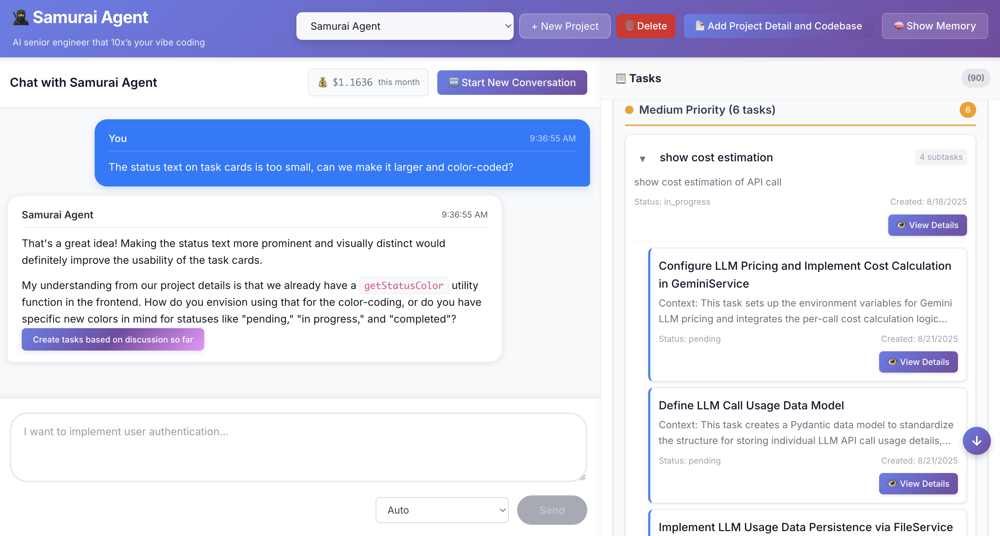
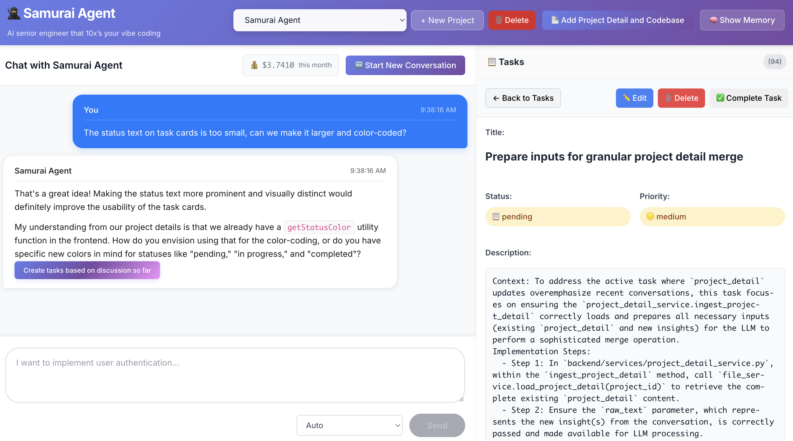

# Samurai Agent 
AI tool for spec-driven development that debugs requirements to prevent messy AI-generated code.




---

## 🚀 SaaS Version Coming Soon 
Love the concept but want a hosted solution? 

We're building Samurai Agent Cloud with: 

- Advanced AI Agent (Better and faster)
- No local setup required  
- More integrations (Jira, GitHub, Slack)

👉 [Join the waitlist](https://tally.so/r/3yQOJx)

---

## Why We Built This

We were frustrated spending hours fixing messy AI-generated code. We kept wishing AI tools could write the code we actually wanted on the first try.

Then we had a realization: the problem wasn't the AI coding agents—it was our planning process. Vague requirements inevitably lead to vague code, regardless of how sophisticated the AI is.

We knew spec-driven development could solve this, but existing tools either generate generic templates or assume you already know what you want to build. We needed something that would systematically debug our requirements before we started coding.

So we built Samurai Agent.

*We're actively developing this and would love your feedback in our issue.*

---

## How We Solve the Messy AI Code Problem

We debug specifications before code gets written.

Vague specifications force AI to make assumptions, leading to code that works but solves the wrong problem. Samurai Agent analyzes your codebase and systematically identifies ambiguities, missing requirements, and potential conflicts before you start coding.

**The difference:**

❌ Vague spec: *"Add a button"*
- AI doesn't know where, what it does, or how it fits with existing code

✅ Debugged spec: *"Add a 'Create Task' button in `TaskList.tsx`, positioned below the existing task grid, that opens the NewTaskModal component when clicked"*
- Clear location, functionality, and integration points

Our agent asks targeted questions about edge cases, dependencies, and implementation details until your specification is precise enough that any AI tool will generate exactly what you want.

---

## ✨ How This Changes Your Workflow

**Old way (with AI coding tools today):**
1. Give vague instructions to AI
2. AI makes assumptions and writes code
3. Spend hours debugging unintended behavior
4. Repeat until it works

**New way (with Samurai Agent):**
1. Spend 10-15 minutes clarifying requirements with Samurai Agent
2. Get precise specifications with implementation details
3. Copy the spec and paste it into any AI coding tool (Cursor, Copilot, Claude, etc.)
4. Get working code that matches your intent

**Result:** Less time fixing, more time building.

---

## 🔄 Works with Your Existing Tools

Samurai Agent doesn't replace your favorite AI coding tools - it makes them work better. Simply copy the refined specifications and paste them into:
- Cursor
- GitHub Copilot  
- Claude Code
- Or any AI coding assistant

---

## ✨ What Makes Samurai Agent Different?

**vs. ChatGPT / General LLMs**
- Samurai Agent has codebase context and software engineering-specific knowledge
- Systematically probes for missing requirements instead of just answering questions

**vs. Cursor/Cline Planning Mode**
- They break down what you tell them, but don't challenge unclear requirements
- Samurai Agent actively identifies flaws in your specifications using codebase analysis
- Pushes back with targeted questions instead of accepting vague inputs

**vs. Traditional Planning Tools**
- Most tools generate generic templates or accept whatever you input
- Samurai Agent forces specification clarity through systematic questioning


## ⚡ Quick Start

### 1. Clone repo

```bash
git clone https://github.com/suzuking1192/samurai-agent.git
```

### 2. Backend Setup

Copy the example env file and add your key:

```bash
cd backend
cp .env.example .env
```

Get a Gemini API key: [Google AI Studio](https://aistudio.google.com/app/apikey)

Add it to `.env`:

```bash
GEMINI_API_KEY=your_key_here
```

Run with Docker:

```bash
docker compose up --build
```

Or without Docker:

```bash
cd backend
python -m venv .venv
# Linux/macOS:
source .venv/bin/activate
# Windows (PowerShell):
# .\.venv\Scripts\Activate.ps1
pip install -r requirements.txt
uvicorn main:app --reload
```

### 3. Frontend Setup

```bash
cd frontend
npm install
npm run dev
```

- Backend -> http://localhost:8000
- Frontend -> http://localhost:5173

---

## 🏃 How to Use

### 1. Create a New Project
- Click "Create Project" and give it a name
- Add project documentation if available (helps Samurai Agent understand your codebase)
- Connect your codebase folder (only folder structure is saved, not file contents)
- You can update project details anytime using the button at the top

### 2. Start a New Conversation
Click "Start New Conversation" for each feature you want to plan. This keeps the context focused on one task at a time.

### 3. Describe Your Feature
Tell Samurai Agent what you want to build. If your request is too broad, it will ask you to narrow the scope first. Once focused, it will systematically ask clarifying questions to debug your requirements.

### 4. Generate Tasks
When the discussion feels complete (or Samurai Agent stops asking questions), click "Create tasks based on discussion so far" at the bottom of the chat. This generates structured tasks in the right sidebar.

### 5. Copy to AI Coding Tools
Click "View Details" on any task to see the complete specification. Use the copy button to paste these specs directly into Cursor, Copilot, or any AI coding assistant.